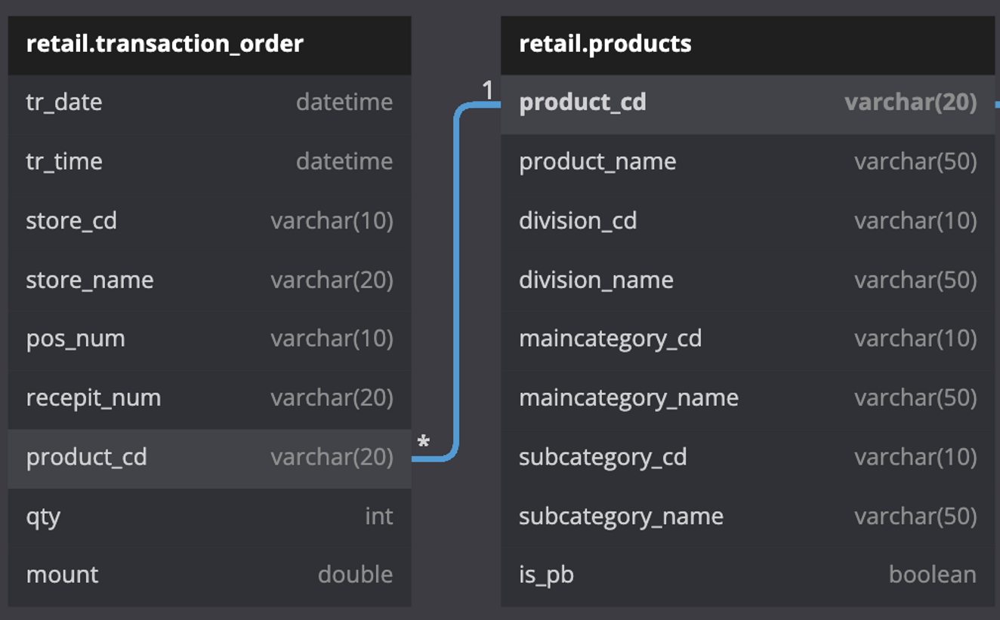

# [2023] HIST 데이터 엔지니어링 역량강화 - Streaming Data Pipeline on AWS
해당 자료는 한진정보통신에서 데이터 엔지니어링 역량강화 과정 중 실시간 스트리밍 데이터 파이프라인 구축에서 사용하는 자료입니다. 

데이터 수집 -> 저장 -> 분석/처리 -> 시각화(선택)를 각 단계를 AWS의 서비스를 이용하여 구축할 예정입니다.

## Solutions Architecture Overview

## 사용 데이터 
### XX 편의점(등촌점 1개 지점)

#### ERD

#### 제품 데이터 (Dimension)
- 총 데이터 : 5,446 건
- 대,중,소 분류, 제품명, PB 상품 여부

#### 거래 데이터 (Fact)
- 총 데이터 : 94,498
- 크기 : 5.7MB
- 기간 : 2015-01-01~2015-06-30

