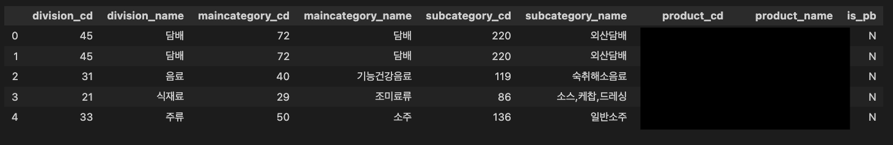
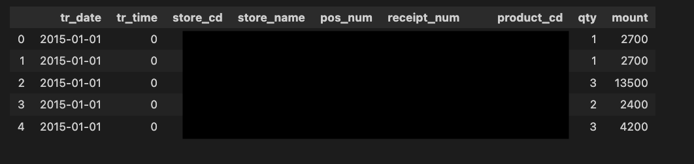
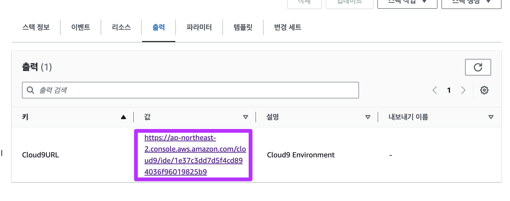

# [2023] HIST 데이터 엔지니어링 역량강화 - Streaming Data Pipeline on AWS
해당 자료는 한진정보통신에서 데이터 엔지니어링 역량강화 과정 중 실시간 스트리밍 데이터 파이프라인 구축에서 사용하는 자료입니다. 

데이터 수집 -> 저장 -> 분석/처리 -> 시각화(선택)를 각 단계를 AWS의 서비스를 이용하여 구축할 예정입니다.


## <a name="solutions-architecture-overview"></a>Solutions Architecture Overview


## 사용 데이터 
### XX 편의점(등촌점 1개 지점)

#### ERD


#### 제품 데이터 (Dimension)
- 총 데이터 : 5,446 건
- 대,중,소 분류, 제품명, PB 상품 여부



#### 거래 데이터 (Fact)
- 총 데이터 : 94,498
- 크기 : 5.7MB
- 기간 : 2015-01-01~2015-06-30




## 사전 준비 
### Cloudformation
#### Launch Cloudfomration(선택)

[`**Launch Cloudformation**`](https://console.aws.amazon.com/cloudformation/home#/stacks/new?&templateURL=https://workshop-blee.s3.ap-northeast-2.amazonaws.com/cloudformation/prerequisites.yaml)

#### 생성 리소스
1. VPC
2. Public Subnet
3. Public RouteTable
4. IGW(Internet Gateway)
5. Cloud9(IDE)

### Cloud9
Cloudformation 출력 내 Cloud9 URL 클릭



### 파일다운로드
```shell
wget https://github.com/byungjun0689/aws-streaming-sample-hist/archive/refs/heads/main.zip

unzip main.zip

cd aws-streaming-sample-hist

chmod +x setup/set-up-streaming-hands-on-cloud9.sh 
# ec2에서 실행하려면 set-up-streaming-hands-on-ec2.sh

ls -lat setup/set-up-streaming-hands-on-cloud9.sh 
-rwxrwxr-x 1 ec2-user ec2-user 970 Aug  9 04:12 set-up-streaming-hands-on-cloud9.sh 
```

### 필요 라이브러리 설치 
```shell
./setup/set-up-streaming-hands-on.sh
```