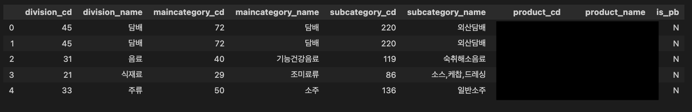
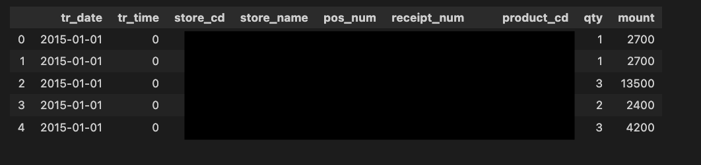
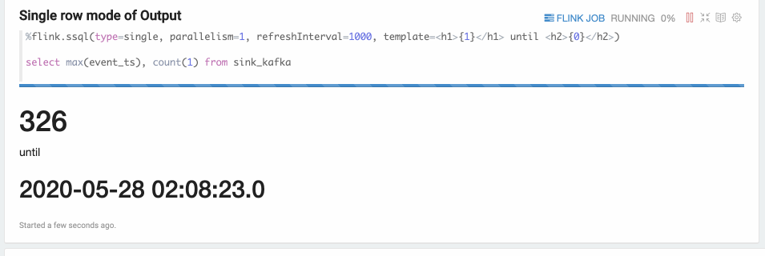
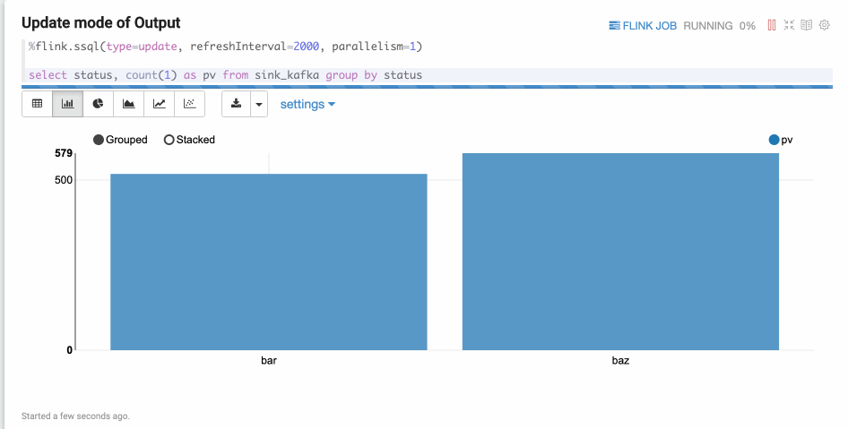
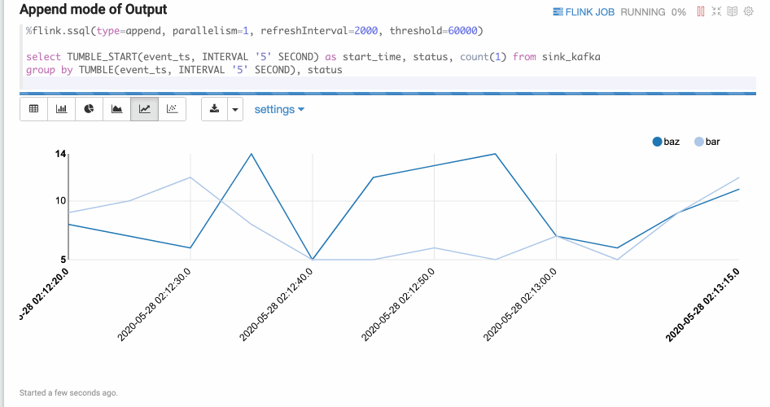

# [2023 역량강화] 스트리밍 데이터 파이프라인 오프라인 강의
# 1. 목적
> 💡 실시간으로 생성되는 스트리밍 데이터를  AWS 서비스를 활용하여 수집 → 저장 → 분석/처리 → 시각화 파이프라인을 구성하는 방법에 대해서 학습한다.

</br>

## 1.1 강의의 목적
- `Data Engineering 역량강화 인원`에 대해 온라인 강의 수강 후 실제 데이터를 활용하여 전반적인 Data Engineering에 대한 복습과 함께 실시간으로 생성되는 데이터를 Lambda Architecture를 이용하여 배치, 스피드 레이어를 구성하는 형태로 서비스를 제공하는 것을 간략하게 경험해보는 것.
</br>
</br>

## 1.2 해당 `Hands-on` Pipeline의 목적 및 주제

- XX 편의점에서 실시간 매출을 기반으로 데이터를 수집, 저장, 분석 후 시각화 할 수 있는 플랫폼을 구축하고자 한다.
</br>
</br>

## 1.3 강의 기준
- AWS 서비스를 전혀 사용해보지 못한 사용자를 기반으로 설명.
</br>
</br>

</br>
</br>

# 2. AWS Streaming DATA 아키텍처 및 사전 준비


</br>
</br>

# 3. DATA


## 3.1 제품 데이터 (Dimension)

- 총 데이터 : 5,446 건
- 대,중,소 분류, 제품명, PB 상품 여부

  

## 3.2 거래 데이터 (Fact)

- 총 데이터 : 94,498
- 크기 : 5.7MB
- 기간 : 2015-01-01~2015-06-30

  

</br>
</br>

# 4. 사전준비
## 4.1 Cloudformation

> 4.1.1 또는 4.1.2 둘중에 하나 방법으로 Cloudformation 수행
> 

### 4.1.1 Launch Cloudfomration(선택)

[`Launch Cloudformation`](https://console.aws.amazon.com/cloudformation/home#/stacks/new?&templateURL=https://workshop-blee.s3.ap-northeast-2.amazonaws.com/cloudformation/prerequisites.yaml)

### 4.1.2 Local Upload(선택)

  [prerequisites.yaml](img/prerequisites.yaml)

  

### 4.1.3 생성 리소스

1. VPC
2. Public Subnet
3. Public RouteTable
4. IGW(Internet Gateway)
5. Cloud9(IDE)

## 4.2 Cloud9

### 4.2.1 Launch Cloud9
Cloudformation 출력 URL 선택 

  

  ### 4.2.2 파일 다운로드

  

  ```bash
  wget https://github.com/byungjun0689/aws-streaming-sample-hist/archive/refs/heads/main.zip

  unzip main.zip

  cd aws-streaming-sample-hist-main

  chmod +x setup/set-up-streaming-hands-on-cloud9.sh 
  # ec2에서 실행하려면 set-up-streaming-hands-on-ec2.sh

  ls -lat setup/set-up-streaming-hands-on-cloud9.sh 
  -rwxrwxr-x 1 ec2-user ec2-user 970 Aug  9 04:12 setup/set-up-streaming-hands-on-cloud9.sh 
  ```

### 4.2.3 필요 라이브러리 설치

```bash
./setup/set-up-streaming-hands-on-cloud9.sh
```

</br>
</br>

# 5. S3
> 💡 [AWS S3 란?]('https://www.notion.so/AWS-S3-8c5afd0c5df64f589009b10de7df1c52?pvs=21') 

스트리밍 데이터가 저장 될 저장소로 S3 버킷 내 폴더 생성이 필요.

## 5.1 버킷 생성

- 버킷명 : hist-streaming-lab-{accountid}
    - hist-streaming-lab-blee
- 나머지는 디폴트로 그대로 생성

## 5.2 폴더 생성

- data/stream_data
- data/stream_error_data
- data/transform_data
- data 폴더 내 3개 추가 폴더 생성

</br>
</br>

# 6. DynamoDB

> 💡 [Amazon DynamoDB란?](https://www.notion.so/Amazon-DynamoDB-259858b37b13422c8ed0b2b72eb78e05?pvs=21) 

Dimension 데이터인 제품 정보를 빠르게 접근하여 가지고오기 위해서 Key-Value NoSQL DB인 DynamoDB를 사용.

## 6.1 DynamoDB Table 생성

> 💡 [DynamoDB Console](https://ap-northeast-2.console.aws.amazon.com/dynamodbv2/home?region=ap-northeast-2#tables) 

AWS Management Console에서 DynamoDB 서비스를 선택


1. 좌측 메뉴 테이블 선택
2. 우측 상단에 테이블 생성 선택
3. 아래와 같이 내용 입력 후 생성
- 테이블이름 : products_info_{accountid}
    - 예) products_info_blee
- 파티션 키 : `product_cd`
- 테이블 설정 : 설정 사용자 지정
- 테이블 클래스 : DynamoDB Standard
- 용량 모드 : 온디멘드
- 나머지는 그대로

  

## 6.2 데이터 import

`Cloud9 IDE`

- 주의사항 dynamodb-table-name 에 위에서 생성한 dynamodb table name 을 입력해야함.
그렇지 않으며 잘못입력한 dynamodb table의 신규로 생성되어 해당 table에 데이터가 입력됨.
  ```bash
  # on Cloud9 IDE

  cd /home/ec2-user/environment/aws-streaming-sample-hist-main/python

  python import_productsdata_to_dynamo.py --region-name ap-northeast-2 --dynamodb-table-name products_info_blee

  /usr/local/lib/python3.7/site-packages/boto3/compat.py:82: PythonDeprecationWarning: Boto3 will no longer support Python 3.7 starting December 13, 2023. To continue receiving service updates, bug fixes, and security updates please upgrade to Python 3.8 or later. More information can be found here: https://aws.amazon.com/blogs/developer/python-support-policy-updates-for-aws-sdks-and-tools/
    warnings.warn(warning, PythonDeprecationWarning)
  Total insert :  5446
  completed
  ```
  

## 6.3 데이터 확인

AWS Management Console에서 DynamoDB 서비스를 선택

1. 테이블(Table) 
2. 위에서 생성한 테이블 선택
3. 표 항목 탐색
  
  

</br>
</br>

# 7. Kinesis
> 💡 [AWS Kinesis Family 정리](https://www.notion.so/AWS-Kinesis-Family-7d6cc9e46dd54d729ce15f619bd485b2?pvs=21)


## 7.1 입력을 수신할 Kinesis Data Streams 생성

AWS Management Console에서 Kinesis 서비스를 선택


1. 시작하기
2. Kinesis Data Streams 선택 후 데이터 스트림 생성
3. 구성
    1. 이름 
        1. de-enhancement-{accountid}
        2. de-enhancement-blee
    2. 스트림 용량 : 온디멘드
4. 생성
5. 상태(Status) 가 활성화(Active) 될 때까지 대기</br>
  
  

## 7.2 수신한 Stream을 S3로 저장하기 위한 Kinesis Data Firehose 생성

Kinesis Data Firehose는 Stream에 적재 되어있는 데이터를 특정 목적지에 전달할 수 있는 서비스.</br>
S3, OpenSearch, Redshift 등 AWS 서비스 외에도 다양한 목적지에 전달이 가능하다.</br>
AWS Management Console에서 Kinesis 서비스를 선택</br>


1. Kinesis Data Firehose 선택 
2. 전송 스트림 생성 버튼 클릭
3. 소스 및 대상 선택
    1. 소스 : `Amazon Kinesis Data Streams`
    2. 대상 : `Amazon S3`
4. 소스 설정
    1. 찾아보기 
    2. 위에서 생성한 Kinesis Data Streams 선택
5. 전송 스트림 이름
    1. de-enhancement-firehose-{accountid}
    2. de-enhancement-firehose-blee
6. 레코드 변형 및 변환 - 디폴트(전체 disabled)
7. 대상 설정
    1. S3 버킷 선택(위에서 생성한 Bucket) - hist-streaming-lab-{accountid}
    2. S3 접두사(prefix)
        
        ```
        data/stream_data/year=!{timestamp:yyyy}/month=!{timestamp:MM}/day=!{timestamp:dd}/hour=!{timestamp:HH}/
        ```
        
        스트림 데이터가 생성되는 이벤트 Timestamp를 기반으로 yyyy/MM/dd/HH 로 구분하여 partition을 나눠서 입력되도록 지정
        
    3. S3 오류 접두사(error prefix)
        
        ```
        data/stream_error_data/year=!{timestamp:yyyy}/month=!{timestamp:MM}/day=!{timestamp:dd}/hour=!{timestamp:HH}/!{firehose:error-output-type}
        ```
        
        오류 데이터의 결과를 전달하는 S3 폴더 지정
        
8. 힌트, 압축 및 암호화 버퍼
    1. 버퍼 크기 또는 간격 둘중에 하나의 조건에 맞을 때 데이터를 S3로 전달
    2. 버퍼 크기 : 1MB
    3. 버퍼 간격 : 60초
    4. 나머지는 디폴트
9. 고급 설정 내 IAM Role 생성 하는 부분은 그대로 생성하도록 유지
    
    
    
10. 나머지 항목은 디폴트
  </br>
  
  

## 7.3 데이터 전송 확인

미리 생성되어있는 Generator 를 통해 데이터 전송이 되는지 확인 필요.

`Kinesis Data Streams → KInesis Data Firehose → S3` 정상 수집되는지 확인 수행

1. 위에서 생성한 Cloud9 접속
2. `gen_kinesis_data.py` 을 실행
    ```bash
    cd /home/ec2-user/environment/aws-streaming-sample-hist-main/python
    
    python gen_kinesis_data.py \
      --region-name ap-northeast-2 \
      --dynamodb-table-name products_info_blee \
      --stream-name de-enhancement-blee
    ```
    
3. `python gen_kinesis_data.py` 사용법은 —help 옵션으로 확인 가능
    ```bash
    python gen_kinesis_data.py --help
    
    usage: gen_kinesis_data.py [-h] [--region-name REGION_NAME]
                               [--dynamodb-table-name DYNAMODB_TABLE_NAME]
                               --stream-name STREAM_NAME
    
    optional arguments:
      -h, --help            show this help message and exit
      --region-name REGION_NAME
                            aws region name (default: ap-northeast-2)
      --dynamodb-table-name DYNAMODB_TABLE_NAME
                            The name of the dynamodb to put the data record into.
      --stream-name STREAM_NAME
                            The name of the stream to put the data record into.
    ```
    
4. 데이터가 생성되고 있으며 10 전송될때 마다 Output 을 보여준다.
    
    
5. 60초 또는 1MB 데이터가 쌓인 후 S3로 결과물이 전송이 된다. S3 에서 확인
    
    
    
    

</br>
</br>

# 8. S3에 저장된 데이터 Athena를 이용해서 분석하기
.png)

## 8.1 Glue Catalog Database 생성

1. AWS Management Console 에서 Glue 서비스 선택
2. 좌측 Data Catalog → Databases 선택
3. 우측 Add Database 선택
    
    
    
4. 상세 정보 입력 후 생성
    1. 이름 : de_enhancement_db_{accountid}
    2. Location(옵션) : s3://hist-streaming-lab-blee/data/stream_data/
        1. streaming data가 적재 되는 위치
    3. Desc(옵션)
    
    
    
5. 생성 완료
    
    
    
    
    

## 8.2 Table 생성 on Athena

### 8.2.1 테이블 생성

```sql
CREATE EXTERNAL TABLE `de_enhancement_db_blee.transaction_order2`(
	tr_date string COMMENT 'transaction date',
	tr_time string COMMENT 'transaction time HH' ,
	store_cd string COMMENT 'Store Code',
	store_name string COMMENT 'Store Name KR',
	pos_num string COMMENT 'POS Machine Number',
	receipt_num string COMMENT 'Receipt Number',
	product_cd string COMMENT 'Product Code',
	qty int COMMENT 'Quantity',
	mount float COMMENT 'Price of Order',
	division_cd string COMMENT 'Division Code',
	division_name string COMMENT 'Division Name' ,
	maincategory_cd string COMMENT 'MainCategory Code',
	maincategory_name string COMMENT 'MainCategory Name',
	subcategory_cd string COMMENT 'SubCategory Code',
	subcategory_name string COMMENT 'SubCategory Name',
	product_name string COMMENT 'Product Name',
	is_pb string COMMENT 'Whether Product PB',
	tr_datetime timestamp COMMENT 'transacation Timestamp',
	event_time timestamp COMMENT 'Event Timestamp')
PARTITIONED BY ( 
  `year` int, 
  `month` int, 
  `day` int, 
  `hour` int)
ROW FORMAT SERDE 
  'org.openx.data.jsonserde.JsonSerDe' 
STORED AS INPUTFORMAT 
  'org.apache.hadoop.mapred.TextInputFormat' 
OUTPUTFORMAT 
  'org.apache.hadoop.hive.ql.io.IgnoreKeyTextOutputFormat'
LOCATION
  's3://hist-streaming-lab-blee/data/stream_data'
```


### 8.2.2 파티션 데이터 로드
```sql
MSCK REPAIR TABLE de_enhancement_db_blee.transaction_order

SHOW PARTITIONS de_enhancement_db_blee.transaction_order 
# 확인

year=2023/month=08/day=09/hour=23
year=2023/month=08/day=10/hour=00
```

### 8.2.3 데이터 확인

```sql
SELECT * FROM de_enhancement_db_blee.transaction_order LIMIT 10
```


## 8.3 Ad-hoc 분석

### 8.3.1 일자별 총 매출, 거래 건수

```sql
SELECT "tr_date", count(*) as "cnt_of_daily_sales", sum(mount) as "sum_of_daily_sales" 
FROM "de_enhancement_db_blee"."transaction_order"
GROUP BY "tr_date"
ORDER BY "tr_date"
```


### 8.3.2 시간대별 총 매출, 거래 건수

```sql
SELECT "tr_date", "tr_time", count(*) as "cnt_of_daily_sales", sum(mount) as "sum_of_daily_sales" 
FROM "de_enhancement_db_blee"."transaction_order"
GROUP BY "tr_date", "tr_time"
ORDER BY "tr_date", "tr_time"
```


### 8.3.3 대, 중, 소 분류 별 매출

```sql
SELECT "division_name"
        , "maincategory_name"
        , "subcategory_name"
        , count(*) as "cnt_of_sales"
        , sum(mount) as "sum_of_sales" 
FROM "de_enhancement_db_blee"."transaction_order"
GROUP BY "division_name", "maincategory_name", "subcategory_name"
ORDER BY 5 desc
```


# 9. **QuickSight를 이용한 데이터 시각화**


<aside>
💡 [QuickSight 실습](https://www.notion.so/QuickSight-2eabaa233df245aa98c5c2860d171d69?pvs=21) 에서 이론 부분만 확인 ( 실습은 다른 내용 )

1. 아래 권한 및 2.데이터 세트 생성 까지는 개별적으로 수행할 필요 없이 강사만 진행
2. 공통 데이터 셋으로 분석부터 수행

</aside>


## 9.1 설정


### 보안 및 권한

- 상단 QuickSight 관리 메뉴 선택
- 좌측 보안 및 권한 선택
- AWS 서비스에 대한 QuickSight 엑세스 (서비스) 관리 버튼 클릭
- S3 버킷 선택
- 해당 되는 버킷 선택 후 저장


## 9.2 데이터 셋 생성

- 데이터 세트 → 새 데이터 세트 → Athena 선택
    
    
    
    
    
- 데이터 원본 이름
    - `hist-retail`
    
    
    
- 테이블 선택
    - 데이터 베이스 : 위에서 생성한 데이터 베이스 선택(de_enhancement_db_blee)
    - 테이블 : Athena로 생성한 테이블 선택
    - 선택
        - `Visualize` 를 수행하거나 아래와 같이 데이터 확인 후 `저장 및 게시`가 필요함.
    - 데이터 확인을 위해서는 데이터 편집/미리보기 선택하게 되면 확인이 가능함.
    
    
    
    
    

## 9.3 분석

### 9.3.1 일별 매출 및 판매 수 확인


### 9.3.2 시간대별 매출 확인


- 정렬이 뒤죽박죽이 되버린다. 이유는 시간 필드의 데이터 타입이 문자로 되어있어서 정렬이 어려움
    - 해결 방안 : 데이터 세트에서 타입을 문자열에서 숫자로 변경
    <br>
    
    
    
    
    
- 우측 상단 `게시 및 시각화` 버튼 선택  → 분석으로 돌아오게 되면 데이터 변경이 일어난다.
    
    
    
- 정렬 변경 및 차트 타입을 라인으로 변경
    
    
    
    
    

## 9.4 대시보드

간단하게 만든 분석을 많은 사용자들이 같이 공유할 수 있도록 대시보드로 변환하여 공유하고자 한다.


- 이름 : new_retail_dashboard
- 나머지 옵션은 그대로 유지
- 대시보드 게시


대시보드 공유를 통해 QuickSight 사용자 또는 URL 을 공유하여 많은 사용자들이 사용할 수 있도록 할 수 있다.


# 10. Kinesis Data Analytics 를 이용한 실시간 데이터 분석 및 시각화(Realtime 분석)

> 💡 `Flink SQL` [Apache Flink 1.7 Documentation: SQL](https://nightlies.apache.org/flink/flink-docs-release-1.7/dev/table/sql.html)
  <br>
  

## 10.1 Kinesis Data Analytics Studio 노트북 생성

AWS Management Console에서 Kinesis 서비스를 선택 [[Console](https://ap-northeast-2.console.aws.amazon.com/kinesisanalytics/home?region=ap-northeast-2#/list/applications)]

1. 스트리밍 어플리케이션 선택
2. Studio(신규, new) 탭 선택
3. Studio 노트북 생성 선택
    
4. Studio 노트북 이름
    - de-enhancement-studio-{accountid}
    - de-enhancement-studio-blee<br>
    <br>
5. 권한 
    - AWS Glue 데이터베이스 : 위에서 생성했던 Database를 선택(de_enhancement_db_blee)
    <br>
  <br>

6. 나머지는 변경 없이 그대로 진행
    <Br>
    
    
7. 노트북 상태가 `[실행]` 이 되야 수행이 가능하므로 IAM Role 에 권한 추가 부터 수행
    - 실행 버튼 클릭 → Role
    
    
8. IAM Role 선택
    
    
    
    - 정책 연결
        - `AmazonS3FullAccess`
        - `AmazonKinesisFullAccess`
        - `AWSGlueServiceRole`
    - 3개 정책 추가
    
    
    
9. 노트북 상태가 `[실행]` 될때 까지 대기
    
    <aside>
    💡 `Apache Zeppelin 이란?`
    데이터 중심의 기능을 지원하는 웹 베이스의 노트북
    SQL, Scala, Python, R 등의 다양한 언어와 함께 대화형 데이터 분석 및 현업 문서이다. 
    원래는 Apache Spark를 보다 쉽게 개발하고자 만들어진 개발 툴이었으나 현재는 다양한 곳에서 사용이 가능하다. 
    
    단순 분석 및 해당 분석 내용을 간단하게 시각화가 가능하여 대시보드에도 사용되고 있는 분석도구
    
    
    
    </aside>
    
    
    

## 10.2 테이블 생성
### 10.2.1 노트북 생성

> Apache Zeppelin 열기 → Create New note 


- 이름 : `de_flink_sql_example`
  <br>
  

### 10.2.2 테이블 생성
- 'scan.stream.initpos' = 'LATEST' : 가장 최근 Stream만 가지고오도록하는 속성(신규 데이터만)
  ```sql
  %flink.ssql

  CREATE TABLE transaction_order_flink(
    tr_date VARCHAR(10),
    tr_time VARCHAR(10),
    store_cd VARCHAR(10),
    store_name VARCHAR(10),
    pos_num VARCHAR(5),
    receipt_num VARCHAR(20),
    product_cd VARCHAR(30),
    qty INT,
    mount DOUBLE,
    division_cd VARCHAR(10),
    division_name VARCHAR(20),
    maincategory_cd VARCHAR(10),
    maincategory_name VARCHAR(20),
    subcategory_cd VARCHAR(10),
    subcategory_name VARCHAR(20),
    product_name VARCHAR(50),
    is_pb VARCHAR(5),
    tr_datetime TIMESTAMP(3),
    event_time TIMESTAMP(3),
    WATERMARK FOR tr_datetime AS tr_datetime - INTERVAL '5' SECOND)
  PARTITIONED BY (tr_date, tr_time)
  WITH (
    'connector' = 'kinesis',
    'stream' = 'de-enhancement-blee',
    'aws.region' = 'ap-northeast-2',
    'scan.stream.initpos' = 'LATEST',
    'format' = 'json',
    'json.timestamp-format.standard' = 'ISO-8601'
  )
  ```
- 추가
    - 아래 테이블을 추가 하게 되면 Stream이 된 항목에 대해서 다시 처음부터 가지고 올 수 있도록 하는 테이블 생성(추후 계속 실습할때마다 Stream으로 데이터를 전송하기 번거로움)
    ```sql
    %flink.ssql
    
    CREATE TABLE transaction_order_flink_restart(
    	tr_date VARCHAR(10),
    	tr_time VARCHAR(10),
    	store_cd VARCHAR(10),
    	store_name VARCHAR(10),
    	pos_num VARCHAR(5),
    	receipt_num VARCHAR(20),
    	product_cd VARCHAR(30),
    	qty INT,
    	mount DOUBLE,
    	division_cd VARCHAR(10),
    	division_name VARCHAR(20),
    	maincategory_cd VARCHAR(10),
    	maincategory_name VARCHAR(20),
    	subcategory_cd VARCHAR(10),
    	subcategory_name VARCHAR(20),
    	product_name VARCHAR(50),
    	is_pb VARCHAR(5),
    	tr_datetime TIMESTAMP(3),
    	event_time TIMESTAMP(3),
      WATERMARK FOR tr_datetime AS tr_datetime - INTERVAL '5' SECOND)
    PARTITIONED BY (tr_date, tr_time)
    WITH (
    	'connector' = 'kinesis',
    	'stream' = 'de-enhancement-blee',
    	'aws.region' = 'ap-northeast-2',
    	'scan.stream.initpos' = 'TRIM_HORIZON',
    	'format' = 'json',
    	'json.timestamp-format.standard' = 'ISO-8601'
    )
    ```
    

### 10.2.3 Stream 데이터 생성

[7.3 데이터 전송 확인] 동일한 방법으로 수행

```bash
cd /home/ec2-user/environment/aws-streaming-sample-hist-main/python

python gen_kinesis_data.py \
  --region-name ap-northeast-2 \
  --dynamodb-table-name products_info_blee \
  --stream-name de-enhancement-blee
```

## 10.3 Flink Interpreter Type Mode

### 10.3.1 `Type = Single`

1. 결과가 항상 1개의 로우만 Return 되는 상황에서 사용한다. 
2. refreshInterval = ms 을 통해 refresh 되는 타임을 지정
3. template = \<h1> {1} \</h1> until \<h2> {0}\</h2> 과 같이 html 구문을 통해 포맷을 지정할 수 있다 Output
  

### 10.3.2 `Type = Update`

1. 1개 이상의 Result를 Return 해줄때 표시하는 방식
2. 항상 결과값을 연속해서 업데이트 된다.
3. `현재 상태를 바로 보여줄때 사용`
  <br>
  

### 10.3.3 `Type = Append`
1. 추가 모드는 출력 데이터가 항상 추가되는 시나리오에 적합합니다. 예를 들어 `tumble window`을 사용하는 다음 예제입니다.
    - 해당 결과값이 Replace 되는 형태
2. **`Tumble windows`**
    - 예를 들어, 5초 길이의 시간 기반 텀블링 창을 생각해보자. 첫 번째 창(w1)에는 0~5초 사이에 도착한 이벤트가 포함되고, 두 번째 창(w2)에는 5~10초 사이에 도착한 이벤트가 포함되며, 세 번째 창(w3)에는 10~15초 사이에 도착한 이벤트가 포함된다.
    텀블링 창은 5초마다 평가(evaluated)되며 겹치는 창은 없다. ; 각 세그먼트는 별개의 시간 세그먼트를 나타낸다.
    <br>
    사용 예) 매 5분마다 계산되는 주식의 평균 가격 계산    
        
        
3. **`Sliding windows`**
    <br>
    
    
    위 이미지에서 첫 번째 창(w1)에는 0~10초 사이 도달한 이벤트가 포함되고, 두 번째 창(w2)에는 5~15초 사이에 도착한 이벤트가 포함된다. 이때, e3~e6 이벤트는 두 창에 모두 속한다.
    시간 t=15 일 때는 윈도우 w2에 평가되며 이벤트 e1,e2는 이벤트 대기열에서 삭제된다.
    사용 예) 매 초마다 트리거되는 지난 5분 동안의 주가 이동 평균을 계산한다.
    <br>
    

## 10.4 데이터 분석

### 10.4.1 실습1

```sql
%flink.ssql(type=update)

SELECT * FROM transaction_order_flink;
```


### 10.4.2 실습2

- 대분류를 기준으로 매출과 구매 건수 조회
- 시각화
- 단 정렬은 지원되지 않는다. (Realtime) → 에러 발생

```sql
%flink.ssql(type=update)

SELECT division_name, count(*) as cnt_of_sales , sum(mount) as sum_of_sales 
from transaction_order_flink
group by division_name;
```


### 10.4.3 실습 3

tr_datetime 컬럼을 기준으로 1시간 마다 Window(창)을 만들어 Groupby 한 결과를 Return 하는 SQL

대, 중분류 별로 매출합계를 GroupBy 하여 결과를 출력


`TUMBLE` 함수는 3개의 파라미터를 필수로 필요로 한다.

```sql
TUMBLE(TABLE data, DESCRIPTOR(timecol), size)
```

- data: 시간 속성 열과의 관계일 수 있는 테이블 매개 변수입니다.
- timecol: 데이터의 시간 속성 열을 텀블링 창에 매핑해야 하는 시간 속성 열을 나타내는 열 설명자입니다.
- size: 텀블링 윈도우의 너비를 지정하는 기간입니다.

```sql
%flink.ssql(type=update)
SELECT window_start, window_end, division_name,maincategory_name, sum(mount) as sum_of_mount 
FROM TABLE(
   TUMBLE(
     DATA => TABLE transaction_order_flink,
     TIMECOL => DESCRIPTOR(tr_datetime),
     SIZE => INTERVAL '1' HOURS))
	GROUP BY window_start, window_end, division_name, maincategory_name;
```


### 10.4.4 실습 4

결과값 1개를 반환하는 Single Type의 결과물로 현재까지의 판매금액, 방문객, 최종 거래 일시를 표시

```sql
%flink.ssql(type=single, parallelism=1, refreshInterval=1000, template=<h1> Today Sales </h1> <h1> 판매금액 : {2}</h1> <h2> 방문객 : {1} <h2> 현재까지 <h2>{0} </h2>)

SELECT max(tr_datetime), count(distinct receipt_num), sum(mount) from transaction_order_flink
```


### 10.4.5 실습 5

- 1시간당 매출 합계 추이

```sql
-- 텀블링 창을 집계로 활용 (1시간 동안 매출)
%flink.ssql
SELECT window_start, window_end, sum(mount) as sum_of_mount FROM TABLE(
   TUMBLE(
     DATA => TABLE transaction_order_flink,
     TIMECOL => DESCRIPTOR(tr_datetime),
     SIZE => INTERVAL '1' HOURS))
  GROUP BY window_start, window_end;
```


### 10.4.6 실습6

1시간씩 누적하여 최종 24시간 매출을 누적 표출해주는 SQL


CUMULATE 함수는 3개의 필수 파라미터를 포함한다.

```sql
CUMULATE(TABLE data, DESCRIPTOR(timecol), step, size)
```

- data: 시간 속성 열과의 관계일 수 있는 테이블 매개 변수입니다.
- timecol: 데이터의 시간 속성 열을 텀블링 창에 매핑해야 하는 시간 속성 열을 나타내는 열 설명자입니다.
- step: 순차 누적 윈도우의 끝 사이에 증가된 윈도우 크기를 지정하는 기간입니다.`(윈도우 너비 증가 분)`
- size: 누적 윈도우의 최대 너비를 지정하는 기간입니다. size는 스텝의 정수배여야 합니다.`(윈도우 최대 너비Size)`

```sql
-- CUMULATE 누적 매출
-- 1시간씩 데이터를 누적하되, 24시간이 최대로 누적되고 다음날이 되면 다시 Reset
%flink.ssql
SELECT window_start, window_end, sum(mount) as sum_of_mount FROM 
	TABLE(
    CUMULATE(
      DATA => TABLE transaction_order_flink3,
      TIMECOL => DESCRIPTOR(tr_datetime),
      STEP => INTERVAL '1' HOURS,
      SIZE => INTERVAL '24' HOURS))
	GROUP BY window_start, window_end;
```


- `누적된 데이터 S3로 적재하기`
    ```sql
    %flink.pyflink
    st_env.get_config().get_configuration().set_string(
        "execution.checkpointing.mode", "EXACTLY_ONCE"    
    )
    
    st_env.get_config().get_configuration().set_string(
        "execution.checkpointing.interval", "1min"    
    )
    ```
    ```sql
    %flink.ssql
    DROP TABLE IF EXISTS timely_cumulate_sum_of_sales;
    
    CREATE TABLE timely_cumulate_sum_of_sales(
        window_start TIMESTAMP,
        window_end TIMESTAMP,
        sum_of_mount DOUBLE
    )
    WITH (
       'connector'='filesystem',
       'path' = 's3a://hist-streaming-lab-blee/data/summary/timely_cumulate_sum_of_sales',
       'format' = 'json',
       'sink.partition-commit.policy.kind'='success-file',
       'sink.partition-commit.delay' = '1 min'
    )
    ```
    
    ```sql
    %flink.ssql(type=update)
    
    INSERT INTO timely_cumulate_sum_of_sales SELECT window_start, window_end, sum(mount) as sum_of_mount FROM 
    	TABLE(
        CUMULATE(
          DATA => TABLE transaction_order_flink_restart,
          TIMECOL => DESCRIPTOR(tr_datetime),
          STEP => INTERVAL '1' HOURS,
          SIZE => INTERVAL '24' HOURS))
    	GROUP BY window_start, window_end;
    ```
    
    
    
    
    
    
    

### 10.4.7 실습7

ROLL UP 함수를 사용하여 대분류 전체를 집계하는 SQL 

```sql
-- 윈도우 집계 ROLL UP(대분류 별로 매출)
%flink.ssql
SELECT window_start, window_end, division_name, sum(mount) as sum_of_mount
	FROM TABLE(
   TUMBLE(
     DATA => TABLE transaction_order_flink3,
     TIMECOL => DESCRIPTOR(tr_datetime),
     SIZE => INTERVAL '1' HOURS))
  GROUP BY window_start, window_end, ROLLUP(division_name)
  HAVING division_name is not null and SUM(mount) > 20000; -- 2만원 이상 매출

```


### 10.4.8 실습8

1시간 마다 매출 TOP3 대분류를 조회하는 SQL

```sql
%flink.ssql
-- 1시간 마다 매출 TOP 3
SELECT *
  FROM (
    SELECT *, ROW_NUMBER() OVER (PARTITION BY window_start, window_end ORDER BY mount DESC) as rownum
    FROM (
      SELECT window_start, window_end, division_name, SUM(mount) as mount, COUNT(*) as cnt
      FROM TABLE(
        TUMBLE(TABLE transaction_order_flink3, DESCRIPTOR(tr_datetime), INTERVAL '1' HOURS))
      GROUP BY window_start, window_end, division_name
    )
  ) WHERE rownum <= 3;
```


```sql
%flink.ssql
SELECT *
  FROM (
    SELECT *, ROW_NUMBER() OVER (PARTITION BY window_start, window_end ORDER BY mount DESC) as rownum
    FROM (
      SELECT window_start, window_end, division_name, SUM(mount) as mount, COUNT(*) as cnt
      FROM TABLE(
        TUMBLE(TABLE transaction_order_flink3, DESCRIPTOR(tr_datetime), INTERVAL '1' HOURS))
      GROUP BY window_start, window_end, division_name
      HAVING division_name not in ('담배')
    )
  ) WHERE rownum <= 3;
```

